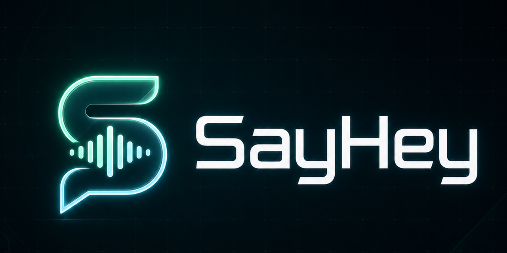

# SayHey



中文说明 | [English](README_EN.md)

SayHey 是一个 Windows 桌面实时语音翻译工具，适合游戏语音沟通和外语语音字幕场景。

它目前有两种主要能力：

1. 同声传译：采集你的麦克风，把你的语音实时翻译后输出到虚拟声卡，方便在游戏或语音软件中直接使用。
2. 游戏字幕：采集当前 Windows 扬声器或耳机输出，用悬浮字幕显示翻译结果。

## 先下载使用

如果你只是想直接体验，不需要先看代码。

1. 打开本仓库的 `Releases` 页面。
2. 下载最新的 Windows 压缩包。
3. 解压后，直接运行其中的 `sayhey.exe`。
4. 进入应用右上角设置页，填入你自己的语音服务配置。

## 引擎说明

### 使用火山引擎

- 可以使用同声传译
- 也可以使用游戏字幕
- 需要你自己准备火山引擎 Key

火山引擎控制台快捷入口：

https://console.volcengine.com/speech/new/overview?projectName=default

## 使用前准备

### 如果你要用同声传译

- 建议先安装 VB-Cable
- 在目标游戏或语音软件里，把麦克风切到 `CABLE Output`

默认音频链路是：

```text
真实麦克风 -> SayHey -> CABLE Input -> CABLE Output -> 目标应用
```

### 如果你要用游戏字幕

- 不需要 VB-Cable
- SayHey 会通过 WASAPI loopback 捕获当前系统播放声音
- 这部分目前依赖火山引擎

## 功能特点

- Windows 桌面 GUI
- 实时麦克风语音翻译
- 游戏/系统音频悬浮字幕
- 基于火山引擎实时模式
- 支持运行日志和延迟观察
- 可保存翻译音频

## 自己从源码运行

### 环境要求

- Windows
- Python 3.11 及以上

### 安装依赖

```powershell
python -m pip install -r requirements.txt
```

### 启动 GUI

```powershell
python main.py
```

首次运行时，如果根目录下没有 `settings.json`，程序会自动创建。你也可以通过界面右上角设置页填写和保存配置。

### 查看本机音频设备

```powershell
python scripts\list_audio_devices.py
```

### CLI 示例

```powershell
python scripts\realtime_s2s_voice_demo.py
```

## 自己构建发布版

执行：

```powershell
build\build_nuitka.bat
```

构建完成后会在 `dist\` 下生成 Windows 可执行文件目录和 zip 包。

## 项目结构

- `main.py`：GUI 入口
- `gui/`：桌面界面与悬浮字幕
- `app_core/controller.py`：麦克风同声传译链路
- `app_core/game_subtitle_controller.py`：系统音频字幕链路
- `app_core/audio_io.py`：麦克风采集与音频输出
- `app_core/system_audio.py`：WASAPI loopback 捕获
- `scripts/`：命令行示例和诊断工具

## 说明

- 本项目是桌面音频翻译与字幕工具，不注入游戏。
- 语音服务账号、Key、代理或服务端配置需要你自己准备。
