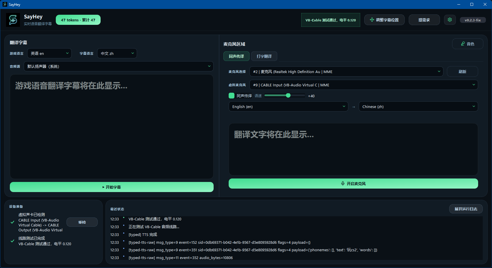

# SayHey


[中文说明](README.md) | English

SayHey is a Windows desktop real-time voice translation tool, designed for in-game voice chat, foreign-language live subtitles, and cross-language meetings.

Main panel preview:



## Core Capabilities

- **Live interpretation**: capture your microphone, translate your speech in real time, and forward the translated audio to a virtual audio device so teammates / the other party hear the translation directly in their game or voice app.
- **Game subtitles**: capture system speaker output and render the foreign-language audio of games / videos / calls as an on-screen overlay subtitle in real time.
- **Typed translation**: type instead of speaking — the text is translated, synthesized to speech, and sent to the virtual microphone, so you can "speak" a foreign language without opening your mouth.

## Download First

If you just want to try it:

1. Open the `Releases` page of this repository.
2. Download the latest Windows package.
3. Unzip it and run `sayhey.exe`.
4. On first launch you can use the built-in trial quota, or fill in your own Volcengine key from the settings dialog at the top-right.
5. The app supports **auto-update** — new versions will prompt to download automatically.

## Features

### Translation & subtitles
- Real-time microphone interpretation (Doubao / Qwen end-to-end speech models)
- System audio overlay subtitles (WASAPI loopback capture) — keeps more history lines to avoid flicker
- Typed translation → text-to-speech output; same-language input auto-skips translation and goes straight to TTS
- Optional: show source text alongside translated subtitles
- Multi-language translation with a unified LangPicker selector
- Same-language scenarios (e.g. zh→zh) prompt a warning to avoid mis-operation

### Hotword system
- Custom hotword list to improve recognition of proper nouns, names, and game terms
- Built-in hotword packs for common games — works out of the box

### Voice customization
- Voice picker dialog with full Doubao / Seed TTS 2.0 / Qwen voice catalog, draggable preview
- Speech rate adjustment (-50 ~ +100); auto-hidden when Qwen engine does not support it
- Save translated audio to disk

### Hotkeys & on-screen hints
- Customizable global hotkey system
- Supports mouse side buttons (X1/X2) as hotkeys
- One-key toggle for mic and subtitles
- Floating on-screen hint when triggering actions

### Devices & audio
- One-click virtual sound card (VB-Cable) detection
- "Advanced" toggle on the main panel — virtual mic / audio source rows hidden by default to simplify daily use
- Virtual loopback devices are hidden from the mic list by default to prevent self-feedback
- Self-feedback device configurations are blocked before live interpretation starts
- Auto-selects CABLE Input as the default output on first launch
- Automatic conflict handling when game subtitles and live interpretation share the same virtual line

### Other
- Built-in trial proxy (`trial.sayhey.top`) — no key required for first try
- Usage tracking & billing (cumulative MT / TTS tokens)
- Built-in feedback entry with improved UI, automatically attaches the app version
- Auto-update (GitHub / Gitee dual source)
- Bundled MiSans font for consistent rendering across machines
- Runtime log panel for latency and error inspection

## Engine Notes

Two real-time large-model speech engines are supported, covering all three pipelines (live interpretation / subtitles / typed translation):

- **Volcengine (Doubao)**: default engine, end-to-end real-time speech
- **Qwen (Alibaba Tongyi)**: optional engine, additional voices and language options

Usage:

- First-time use: try directly with the built-in trial quota
- Long-term use: bring your own Volcengine or Qwen key

Volcengine console shortcut:
https://console.volcengine.com/speech/new/overview?projectName=default

## Before Use

### Live interpretation

- [VB-Cable](https://vb-audio.com/Cable/) is recommended
- In your target app or game, set the microphone to `CABLE Output`

Default audio route:

```text
Real microphone -> SayHey -> CABLE Input -> CABLE Output -> target app
```

### Game subtitles

- VB-Cable is not required
- Captures system playback through WASAPI loopback
- You can pick a specific speaker / headphone under "Audio source" on the main panel

## Run From Source

### Requirements

- Windows 10/11
- Python 3.11 or newer

### Install dependencies

```powershell
python -m pip install -r requirements.txt
```

### Start the GUI

```powershell
python main.py
```

On first run, `settings.json` is created automatically if it does not exist. You can also manage settings from the in-app settings dialog.

### List local audio devices

```powershell
python scripts\list_audio_devices.py
```

### CLI demo

```powershell
python scripts\realtime_s2s_voice_demo.py
```

## Build

```powershell
build\build_nuitka.bat
```

The build script generates the Windows executable directory and zip package under `dist\`. Pushing a `v*` tag to the repository triggers CI to build and publish to GitHub / Gitee automatically.

## Project Layout

- `main.py`: GUI entry point
- `gui/`: desktop UI, overlay subtitles, on-screen hints, settings, voice picker, etc.
- `app_core/controller.py`: microphone live-interpretation pipeline
- `app_core/game_subtitle_controller.py`: system-audio subtitle pipeline
- `app_core/typed_controller.py`: typed-translation pipeline
- `app_core/audio_io.py` / `system_audio.py`: audio capture & WASAPI loopback
- `core/hotkey.py`: global hotkeys / mouse side buttons
- `core/usage_tracker.py`: usage tracking & billing
- `core/update_checker.py`: auto-update
- `scripts/`: CLI samples and diagnostic tools

## Notes

- This project is a desktop translation and subtitle tool. It does not inject into games.
- Bring your own API keys and any required proxy or service configuration (or use the built-in trial).
